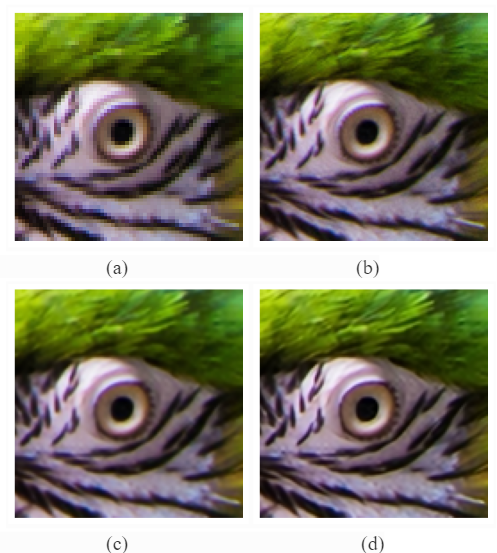

# Image Super Resolution

### TL;DR
Repo to train and test Image Super Resolution models

<p align="center">
    
</p>
<p align="center">
    Figure 1. (a) Low Resolution Image (b) High Resolution Image (c) Super Scaled by U-Net (d) Super Scaled by RRDB-Net
</p>

## Brief Overview

We used [DVI2K](https://data.vision.ee.ethz.ch/cvl/DIV2K/) as our dataset. Our aim is to convert images in 2K resolution to 4K resolution. Patch training is used to reduce the computation resources required for training. Inference is also done in patches and 4K image is reconstructed combining the patches. UNet and RRDBNet are used for training and inference. Bigger models can be used given enough hardware resources. For more details please look into detailed report [here](assests/Project_report.pdf).
## Setup

Use conda to create a python virtual environment and install dependencies

```bash
conda create -n <environment_name> python=3.7

# use GPU
conda install pytorch torchaudio pytorch-cuda=11.6 -c pytorch -c nvidia

pip3 install -r requirements.txt
```

Then run the bash script to download and set up data for training

```bash
bash dataset_setup.sh
```

## Train
To train U-Net model run the command
```bash
python3 main.py --mode=train --model=unet
```
To train RRDB-Net model run the command
```bash
python3 main.py --mode=train --model=rrdbnet
```
## Test
To test the trained U-Net model
```bash
python3 main.py --mode=test --model=unet --model_path=results/<YYYY-MM-DD-HH-MM-SS>/models/<model_name>.pt
```
To test the trained RRDB-Net model
```bash
python3 main.py --mode=test --model=rrdbnet --model_path=results/<YYYY-MM-DD-HH-MM-SS>/models/<model_name>.pt
```
## Repo Structure
```
/image-super-resolution
    |
    -- models (contains all the models used to train and test)
    |   |
    |   -- UNet.py (U-Net model impelmentation)
    |   |
    |   -- RRBDNet.py (RRDB-Net model impelmentation)
    |
    -- utils (contains common functions)
    |   |
    |   -- conversion.py (scripts used for color conversion)
    |   |
    |   -- logger.py (logger)
    |
    -- dataset_setup.sh (bash script to download and create dataset (patches))
    |
    -- dataset_prep.py (reads the dataset folder and created dataset (patches))
    |
    -- dataset.py (PyTorch dataset class used for training, validation and testing)
    |
    -- main.py (main file to execute)
    |
    -- requirements.txt (python library dependencies to run the codebase)
```